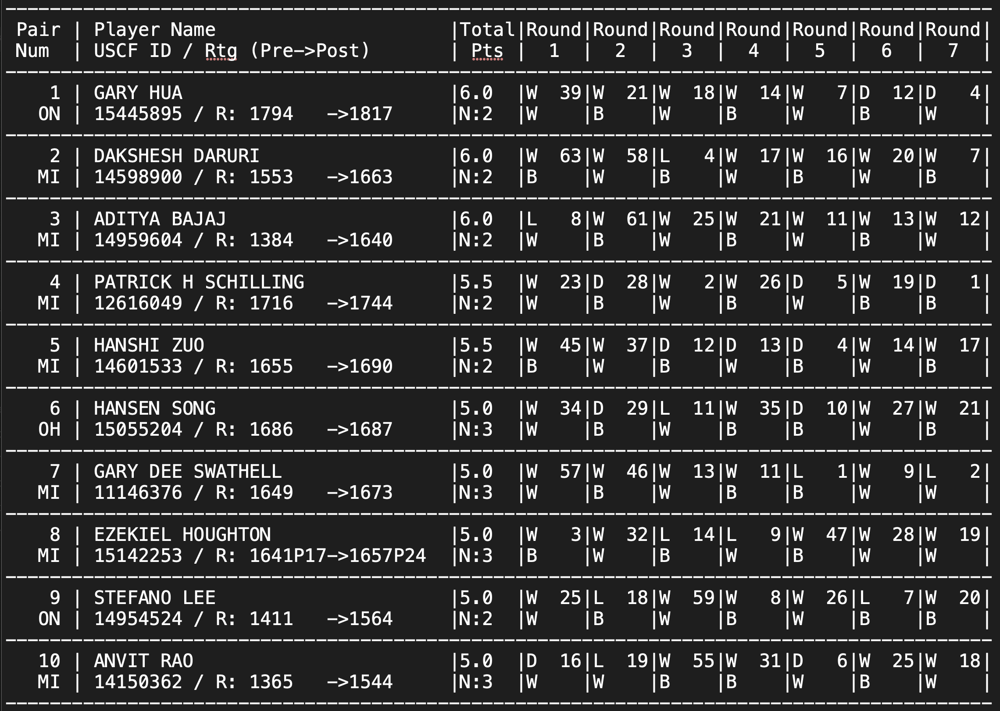

# Setting Up Libraries
I used the library read.so available here: https://rdrr.io/github/alistaire47/read.so/f/README.md. 
I had to install a package called remotes before using it to install the package read.so from github: 

Step 1: install.packages("remotes")

Step 2: remotes::install_github("alistaire47/read.so")

```{r setup, include=FALSE}
library(read.so)
library(dplyr) 
library(stringr)
```

1.
# Reading in All That TEXT
   
   Read.md comes from the package read.so. It takes in markdown from a text file (or just about anywhere, including the clipboard). The textfile looked more or less like a markdown table, so I took a shot with this function. It also allows you to specify a delimiter and strip white spaces from the resulting strings, which I found useful.

```{r}
scores_raw <- read.md(
                file = "./tournamentinfo.txt",
                delim = "|",
                stringsAsFactors = FALSE,
                strip.white = TRUE
                    )
head(scores_raw)
```
2.
# Assessing the Freshly Read Text
   
   Read.md also handled (ignored) all the dashes that indicated line separators. The result is a fairly neat table, but it still needed work to be considered "clean" because the original "table" had "cells" which contained two rows. I saw immediately that this would complicate things- my off-the-shelf solution wasn't smart enough to handle this case, and so it created a new row every time it encountered a newline. As an aside, I think it would be fairly easy to add as a feature a way to handle rows that are actually two rows based on custom row delimiters (in our case the logic would be every two newlines means a new row instead of one).   
   
   I deal with this curve ball later, but first some column renaming and removing the first row which I decided I didnt need. 
```{r Initial Cleanup}
colnames(scores_raw) <- c('Pair', 'Player\'s Name', 'Total Number of Points', 'Round 1', 'Round 2', 'Round 3', 'Round 4', 'Round 5', 'Round 6', 'Round 7')
scores_raw1 = scores_raw[-1,]

head(scores_raw1)
```
3.
# Dealing with the Double Row Situation
   
   Now begins the step of merging every other row with the one above it. For example, the column called Player's Name contains the name "Gary Hua" in the first row. Right under that name on the second row, there is a cell that does not contain a name- it contains Gary Hua's previous tournament information. That information should be on the same row as Gary's name. This pattern is consistent for every name in the list - one row has their name, the next contains their tourney info.   
   
   I realized that I only really cared about the column "Pair", and the column "Player's Name" for my purposes. Meaning that the data in every second row of those column should be brought to the top row- I didn't have to do that for every column because for the other columns, the info I needed was already in the first row. Thus, I used a lead function to create a new column "Prev Score", and for each row, I will populate that new column with the value in column "Player's Name" in the next row.   
   
   All that was left was to then get rid of every other row, because I got the info needed from them. I created a sequence of even numbers the same length as the dataset and removed those rows from the dataset.
```{r Merging Rows}
scores_lead <- scores_raw1 %>%
    mutate(`Prev Score`     = lead(`Player's Name`),
           `Player's State` = lead(`Pair`))

dataset_del_rows <- seq(0, nrow(scores_lead), 2)
scores_raw_cleaned <-  scores_lead[-dataset_del_rows, ]
rownames(scores_raw_cleaned) <- 1:nrow(scores_raw_cleaned)
head(scores_raw_cleaned)
```
4.
# Mutating and Manipulating to Wrangle Strings
   
   Now all the players had all their relevant information on the same row as their name. Now was time for some string manipulation for the columns that contained the results of the separate rounds that they played in. The letter stood for the outcome of the round, W meaning the player on that row won for example, and the number indicated who they played against.   
   
   I wrote a function that isolated the opponent's ID using some string manipulation, and called that function on each row using rowwise (I got the tip to use lapply after I did this). I put the result of the function in a new column called 'Round X Player'. 

```{r String manipulation to Isolate Opponents IDs}
getPlayerID <- function(stringboi) {
  splitboi <- str_split_fixed(stringboi,' ', n =2)
  as.numeric(splitboi[,2])
}

scores_ids <- scores_raw_cleaned %>% 
  rowwise() %>%
  mutate(`Round 1 Player` = getPlayerID(`Round 1`)) %>%
  mutate(`Round 2 Player` = getPlayerID(`Round 2`)) %>%
  mutate(`Round 3 Player` = getPlayerID(`Round 3`)) %>%
  mutate(`Round 4 Player` = getPlayerID(`Round 4`)) %>%
  mutate(`Round 5 Player` = getPlayerID(`Round 5`)) %>%
  mutate(`Round 6 Player` = getPlayerID(`Round 6`)) %>%
  mutate(`Round 7 Player` = getPlayerID(`Round 7`)) 
  
head(scores_ids)
```
5.
# More Mutation to get the Strings Just Right
   
   After getting the opponent's IDs, I knew I had to find the average of each of their opponent's scores. Every row in this table contains a player's pre-tourney score, but I had do some more string manipulation on the column 'Prev Score', which had the player's previous score concatenated to their post-tourney score separated by an arrow. I wrote another function that separated out just the previous score, splitting the string twice and watching out for the 'P' indicator. 

```{r Isolate Player\'s Previous Score}

getPreScore <- function(stringboi) {
  splitboi <- str_split_fixed(stringboi,' ', n =5)
  splitboi2 <- str_split_fixed(splitboi[,4], 'P', n=4)
  strtoi(splitboi2[,1], 0)
}

scores_prev <- scores_ids[, c(1,2,3,11,12,13,14,15,16,17,18,19)] %>%
   mutate(`Player’s Pre-Rating` = getPreScore(`Prev Score`)) 

scores_id_prev <- scores_prev[, c(1,2,3,5,6,7,8,9,10,11,12, 13)]
head(scores_id_prev)
```
6.
# One Last Mutation 
   
   The string manipulation was out of the way, and so I got to work associating each opponent's ID with a score (isolated in the previous step- it's all coming together now). Another set of mutations allowed me to look up each opponent's score from the same table and make a new column out of that.  
```{r Associate opponent ID with opponent score}
scores_associated <- scores_id_prev %>% 
  rowwise() %>%
  mutate(`Round 1 Player Score` = strtoi(scores_id_prev[`Round 1 Player`, 12], 0) )%>%
  mutate(`Round 2 Player Score` = strtoi(scores_id_prev[`Round 2 Player`, 12], 0) )%>% 
  mutate(`Round 3 Player Score` = strtoi(scores_id_prev[`Round 3 Player`, 12], 0) )%>% 
  mutate(`Round 4 Player Score` = strtoi(scores_id_prev[`Round 4 Player`, 12], 0) )%>% 
  mutate(`Round 5 Player Score` = strtoi(scores_id_prev[`Round 5 Player`, 12], 0) )%>% 
  mutate(`Round 6 Player Score` = strtoi(scores_id_prev[`Round 6 Player`, 12], 0) )%>% 
  mutate(`Round 7 Player Score` = strtoi(scores_id_prev[`Round 7 Player`, 12], 0) )

scores_associated_clenaed <- scores_associated[, c(1,2,3,4,12,13,14,15,16,17,18,19)]
head(scores_associated_clenaed)
```
7.
# Finding the Average Opponent Scores
   
   All that was left to do was average the opponent scores using a quick mean function, watching out for na's so that they wouldn't be factored into the average. 
Here is the final table: 
```{r One more mutation do do a row-wise average of the opponents scores}
scores_associated_clenaed$`Avg Opp Pre Rating` <- as.integer(rowMeans(scores_associated_clenaed[,6:12], na.rm=TRUE) )

final_scores<-scores_associated_clenaed[, c(2,4,3,5,13)]
head(final_scores)
```

